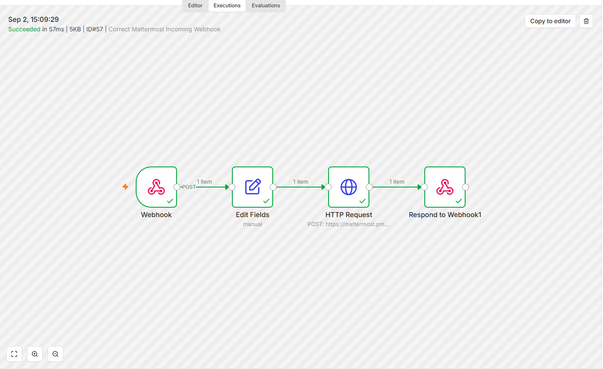
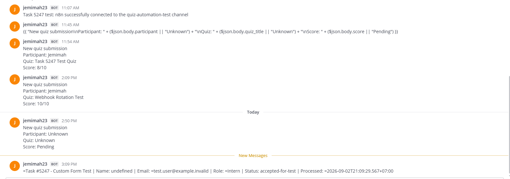

# Task #5247 — Research & Architecture Design: Intern Automation Bots for Self-Hosted Mattermost

A production-oriented proof of concept for attendance, worklogs, mentor reporting, onboarding FAQs, and n8n-driven Mattermost automation.

## Results

| Area | Verified outcome |
|---|---|
| Core automation | Attendance, daily worklog/digest, and FAQ modules implemented |
| Quality | **16 tests passed** with **87.56% branch coverage** |
| Runtime | Local API smoke test and container health checks passed |
| CI/security | GitHub Actions green, SHA-pinned actions, Ruff, preflight, and dependency checks |
| n8n | Published production webhooks executed successfully |
| Mattermost | Dynamic quiz and mock custom-form notifications reached the isolated test channel |

## Architecture

```text
Mattermost/Form Event → n8n → FastAPI Policy Service → PostgreSQL/Mattermost API
```

## Live Validation

```text
Quiz POST → n8n Webhook → HTTP Request → Mattermost notification

Mock Form POST → Webhook → Edit Fields → HTTP Request
→ Mattermost notification → Webhook response
```

The custom-form test processed credential-free mock data for `Test User`, added an `accepted-for-test` status and timestamp, delivered the notification to Mattermost, and completed all four n8n nodes successfully.

## Evidence

### CI Pipeline


### n8n → Mattermost Validation


### Dynamic Quiz Notification


### Custom Form n8n Execution



### Custom Form Mattermost Notification



## Local Verification

```bash
python3 -m venv .venv
.venv/bin/python -m pip install -r requirements-dev.txt
.venv/bin/ruff check .
.venv/bin/python scripts/preflight.py
.venv/bin/pytest --cov=app --cov-report=term-missing
```

Expected: **16 tests passed** and **87.56% coverage**.

## Scope and Security

The design, application, tests, CI pipeline, isolated Mattermost integration, dynamic quiz, and mock custom-form notification are complete. The form workflow is notification-only; creating or adding a real Mattermost user requires an approved destination, permissions, and API method.

No webhook URL, token, password, internal hostname, or real personal data is stored in this repository.