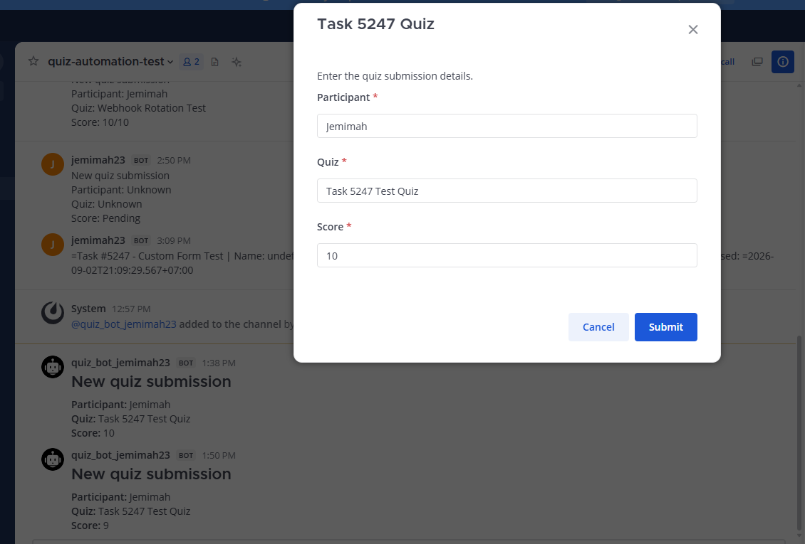
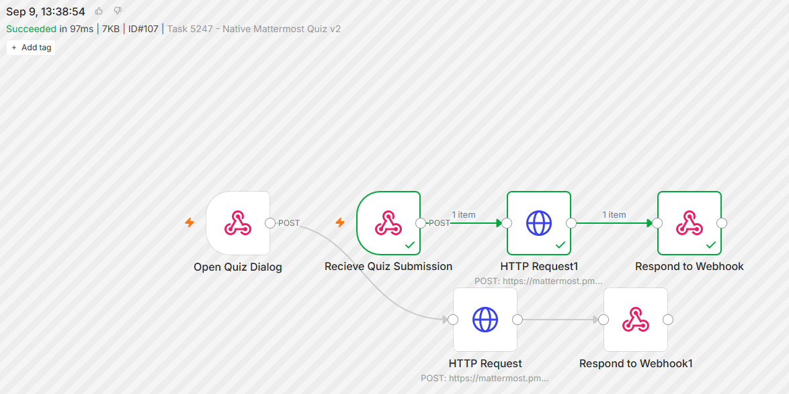
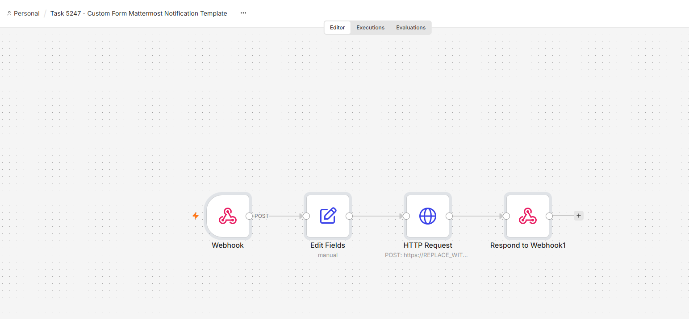

# Task #5247 — Intern Automation Bots for Self-Hosted Mattermost

Research, architecture, and proof of concept for attendance, worklogs, mentor reporting, onboarding FAQs, and Mattermost automation.

## Verified Results

| Area | Outcome |
|---|---|
| Application | Attendance, worklog/digest, and FAQ modules implemented |
| Local validation | 16 tests passed; reported coverage: 87.56%; API and container health checks passed |
| CI | GitHub Actions passed with SHA-pinned actions, Ruff, preflight, and dependency checks |
| Native Mattermost form | `/quiz` opens an interactive dialog directly inside Mattermost |
| Submission | n8n receives the form data, posts it through the bot, and returns a successful response |
| Reusability | Earlier sanitized custom-form template imported successfully |

## Architecture

The application uses FastAPI for policy logic, with PostgreSQL and the Mattermost API as integration targets.

The verified native form runs through two independent n8n webhook flows:

```text
/quiz → Open webhook → Mattermost dialog → Response
Submit → Submission webhook → Bot channel post → Response
```

Users complete the form inside Mattermost. This proof of concept records participant, quiz name, and an entered score; it does not calculate quiz scores.

## Evidence

### Native Form Inside Mattermost



### Successful n8n Execution



### CI Validation


<details>
<summary>Earlier integration and template evidence</summary>

### n8n → Mattermost


### Dynamic Quiz Notification


### Mock Custom-Form Execution


### Mock Custom-Form Notification


### Reusable Template Import



</details>

## Local Verification

```bash
python3 -m venv .venv
.venv/bin/python -m pip install -r requirements-dev.txt
.venv/bin/ruff check .
.venv/bin/python scripts/preflight.py
.venv/bin/pytest --cov=app --cov-report=term-missing
```

Recorded result: **16 tests passed, 87.56% coverage**. Live n8n and Mattermost validation is documented separately above.

## Scope and Security

The native form and bot notification were validated in an isolated test channel. Earlier mock-form tests demonstrated notification delivery, not real-user provisioning.

Production rollout and user provisioning remain outside this validation. Workflow exports must be sanitized before committing; credentials belong in n8n’s credential store. Review screenshots for internal information before sharing.