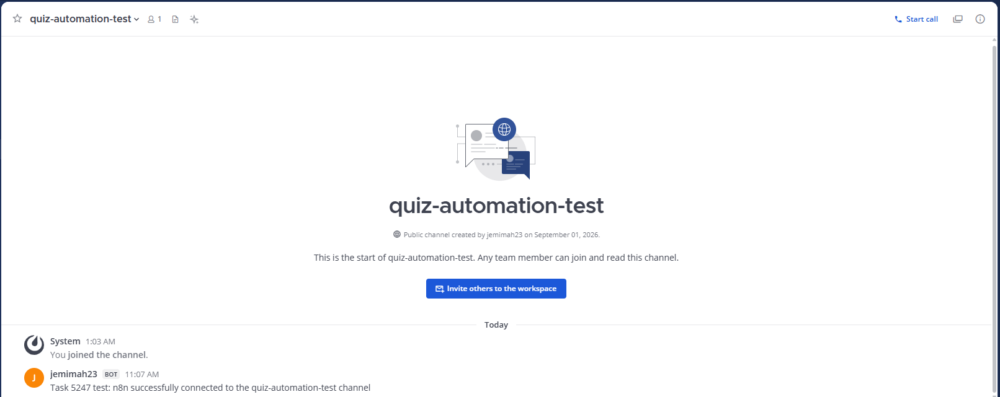
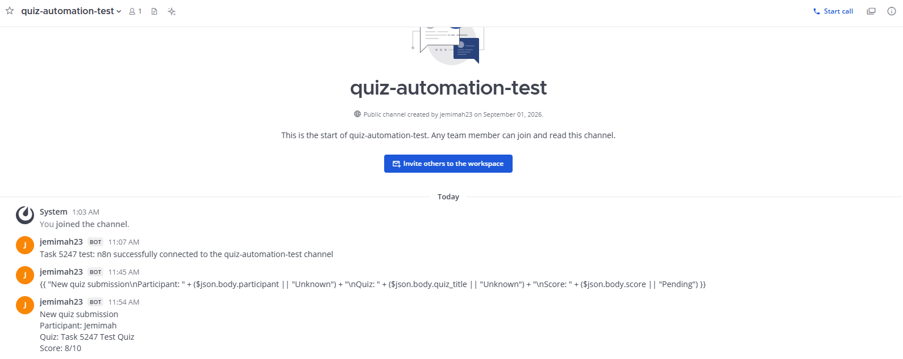

# Mattermost Intern Automation — Task #5247

A production-oriented PoC for attendance, daily worklogs, mentor digests, approved onboarding FAQs, and quiz notifications on self-hosted Mattermost.

Local validation supports Python 3.10–3.12. The production container uses Python 3.12.

## Proof at a Glance

| Result | Evidence |
|---|---|
| Required modules | Check-in/out, worklog/digest, FAQ and quiz notification |
| Automated verification | **16 tests passed** |
| Test coverage | **87.56% including branches** |
| Runtime validation | End-to-end local API smoke test passed |
| CI validation | GitHub Actions pipeline passed |
| Live integration | n8n delivered dynamic quiz data to an isolated Mattermost channel |
| Deployment | Non-root FastAPI container and PostgreSQL Compose stack |
| Security | SHA-pinned GitHub Actions, Ruff and dependency checks |
| Documentation | Architecture, runbook, demo plan and Jira-ready backlog |

## What It Does

| Module | User experience | Control |
|---|---|---|
| Attendance | `/checkin [note]` and `/checkout [note]` | UTC timestamps, Lagos business date and duplicate protection |
| Worklog | `/task completed \| blockers \| next plan` | One updateable daily record and scheduled mentor digest |
| FAQ | `/faq vpn` or `vpn setup` | Approved YAML answers and safe fallback responses |
| Quiz notification | Quiz submission notification | Isolated n8n workflow and Mattermost test channel |

## Selected Design

**n8n orchestration + Python/FastAPI policy service + dedicated Mattermost bot + REST API v4 + slash commands + PostgreSQL**

n8n owns workflow orchestration and schedules. FastAPI owns validation, authorization, data processing, exports, audit events and Mattermost API calls.

This keeps business rules and credentials outside the workflow definitions.

## Live n8n → Mattermost Validation

An isolated validation was completed on 1 September 2026 using the published `Task 5247 - Mattermost Playbook Validation` n8n workflow.

The validated path was:

```text
POST request
    ↓
n8n production Webhook
    ↓
HTTP Request node
    ↓
Mattermost incoming webhook
    ↓
quiz-automation-test channel
```

The workflow accepts the following JSON structure:

```json
{
  "quiz_title": "Task 5247 Test Quiz",
  "participant": "Jemimah",
  "score": "8/10"
}
```

The HTTP Request node dynamically formats the submitted information into a Mattermost notification containing:

- Participant name
- Quiz title
- Quiz score

Validation confirmed that:

- The published n8n production webhook accepted the POST request.
- The workflow started successfully.
- The HTTP Request node delivered the notification.
- The isolated Mattermost channel received the dynamic values.
- No webhook URL, token or credential is stored in this repository.

## Validation Evidence

### 1. CI Pipeline Validation


### 2. n8n → Mattermost End-to-End Validation



### 3. Dynamic Quiz Notification Validation



## Pending Microsoft Forms Integration

The remaining external integration is:

```text
Microsoft Forms
    ↓
Power Automate
    ↓
n8n production Webhook
    ↓
Mattermost
```

This step is pending approved Power Automate access for the company Microsoft account.

## Verify Locally

Create the virtual environment and run the automated checks:

```bash
python3 -m venv .venv
.venv/bin/python -m pip install -r requirements-dev.txt
.venv/bin/ruff check .
.venv/bin/python scripts/preflight.py
.venv/bin/pytest --cov=app --cov-report=term-missing
```

Expected result:

```text
16 passed
Total coverage: 87.56%
```

Run the API locally:

```bash
mkdir -p data

SCHEDULER_ENABLED=false \
DATABASE_URL=sqlite+pysqlite:///./data/intern_bot.db \
.venv/bin/uvicorn app.main:app --host 127.0.0.1 --port 8080
```

Run the smoke test from another terminal:

```bash
bash scripts/smoke_test.sh
```

## Docker Validation

```bash
cp .env.example .env
docker compose config
docker compose up --build -d
curl --fail http://127.0.0.1:8080/health/ready
```

Only approved test credentials should be added to `.env`.

Never commit:

- `.env`
- Bot tokens
- Webhook URLs
- Passwords
- Internal hostnames
- Production data

## Reviewer Route

1. Read the [Submission Summary](docs/SUBMISSION_SUMMARY.md).
2. Review the [Architecture](docs/ARCHITECTURE.md).
3. Run the tests and follow the [Demo Plan](docs/DEMO_AND_VALIDATION.md).
4. Review the [Maintenance Guide](docs/MAINTENANCE_GUIDE.md).
5. Review the [Jira Backlog](docs/JIRA_BACKLOG.md).
6. Complete the [Live Access Checklist](docs/LIVE_ACCESS_CHECKLIST.md).
7. Follow the [GitHub Publication Guide](docs/GITHUB_PUBLISH.md).
8. Review the [n8n Workflow Guide](n8n/README.md).

## Completion Status

### Completed

- Project foundation
- Local validation
- Private GitHub repository
- CI pipeline validation
- Isolated Mattermost test channel
- Published n8n workflow
- Production webhook validation
- Static Mattermost notification
- Dynamic quiz notification
- Participant, quiz title and score mapping
- Screenshot evidence

### Pending

- Power Automate access
- Microsoft Forms connection
- Real form-submission validation
- Confluence publication and review
- Jira import

No production administrator credentials are required.