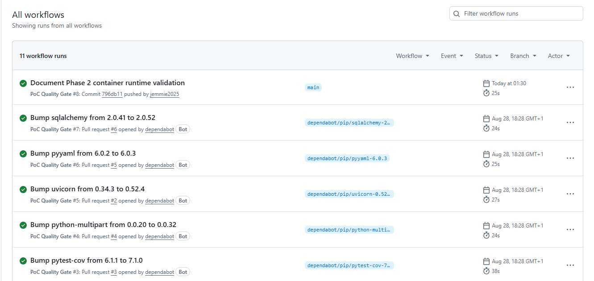
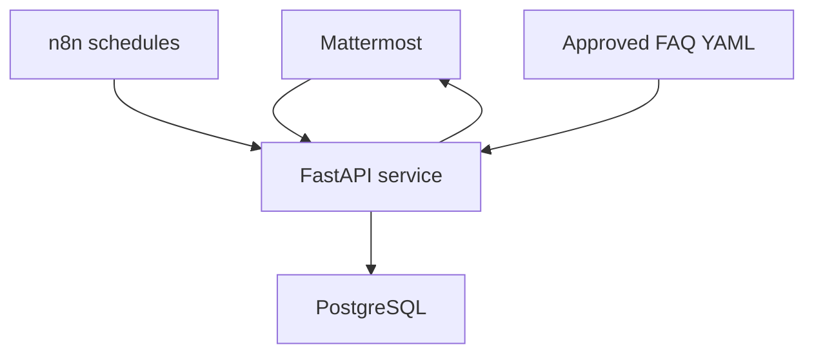

# Mattermost Intern Automation

**Task #5247 — Project Foundation, Secure Runtime, and CI Validation**

A production-oriented proof of concept for automating intern attendance, daily worklogs, mentor reporting, and approved onboarding FAQs in a self-hosted Mattermost environment.

## Delivery Status

| Phase | Scope | Status |
|---|---|---|
| Phase 1 | Project foundation, application modules, tests, documentation, and CI | **Complete** |
| Phase 2 | Docker runtime, persistence, security, smoke tests, exports, and auditing | **Complete** |
| Phase 3 | Live Mattermost and n8n validation | **Pending approval** |

## CI Evidence

The screenshot below confirms that the Phase 2 GitHub Actions quality gate passed successfully on `main`.

<p align="center">
  
</p>

Detailed results are available in [Local Verification Evidence](docs/LOCAL_VERIFICATION.txt).

> This evidence contains test-environment results only. No production credentials, tokens, webhook URLs, or production data are stored in this repository.

## Verified Results

| Validation | Result |
|---|---|
| Automated tests | **16 passed** |
| Branch coverage | **87%+** |
| Repository preflight | **16 checks passed** |
| API readiness | **HTTP 200** |
| Runtime services | FastAPI and PostgreSQL healthy |
| Smoke test | Check-in, worklog, FAQ, and check-out passed |
| Persistence | Data preserved after container restart |
| Export security | Unauthorized request rejected with **HTTP 403** |
| Container security | Non-root user, read-only filesystem, and dropped capabilities |
| GitHub Actions | Phase 2 CI pipeline passed on `main` |

## Core Capabilities

| Module | Function |
|---|---|
| Attendance | Records `/checkin` and `/checkout` with duplicate and sequence protection |
| Daily worklog | Stores one updateable daily report per intern |
| Mentor reporting | Produces authenticated attendance and worklog exports |
| Approved FAQ | Responds only with reviewed YAML-based answers |

## Architecture



- **Mattermost** provides commands, channels, and bot interactions.
- **n8n** manages scheduled automation.
- **FastAPI** handles validation, authorization, business rules, exports, and auditing.
- **PostgreSQL** stores attendance, worklogs, FAQ activity, and audit records.

## Security Controls

- Non-root application user (`UID 10001`)
- Read-only container filesystem
- Linux capabilities dropped
- Privilege escalation blocked
- PostgreSQL isolated on a private Docker network
- Administrative and mentor authorization checks
- Structured audit events
- Secrets and `.env` excluded from Git
- GitHub Actions pinned to full commit SHAs

## Local Validation

```bash
python3 -m venv .venv
.venv/bin/python -m pip install -r requirements-dev.txt
.venv/bin/ruff check .
.venv/bin/python scripts/preflight.py
.venv/bin/pytest --cov=app --cov-report=term-missing
```

Expected baseline:

```text
16 tests passed
87%+ branch coverage
16 preflight checks passed
```

## Docker Compose

```bash
cp .env.example .env
docker compose config
docker compose up --build -d
docker compose ps
curl --fail http://127.0.0.1:8080/health/ready
bash scripts/smoke_test.sh
```

Use approved test-only values in `.env`. Never commit credentials or production data.

Stop the services without deleting the PostgreSQL volume:

```bash
docker compose down
```

## n8n and Live Validation

The repository includes an inactive n8n template with four scheduled triggers and four authenticated API requests.

It must remain inactive until the approved credentials, endpoint, timezone, and test environment are confirmed.

The existing organization-managed Product Release webhook has not been modified or claimed as Task #5247 evidence. A separate test integration will only be created after explicit approval.

## Documentation

- [Submission Summary](docs/SUBMISSION_SUMMARY.md)
- [Architecture](docs/ARCHITECTURE.md)
- [Local Verification Evidence](docs/LOCAL_VERIFICATION.txt)
- [Demo and Validation Plan](docs/DEMO_AND_VALIDATION.md)
- [Maintenance Guide](docs/MAINTENANCE_GUIDE.md)
- [Live Access Checklist](docs/LIVE_ACCESS_CHECKLIST.md)
- [Jira-ready Backlog](docs/jira-import.csv)
- [n8n Workflow Guide](n8n/README.md)
- [Security Guidance](SECURITY.md)

## Completion Statement

The application, automated tests, Docker runtime validation, persistence checks, security controls, documentation, and CI validation are complete.

Final acceptance requires approval for a restricted Mattermost test channel, dedicated bot identity, approved n8n credentials, and a stakeholder-observed live demonstration.

No production administrator credentials are required or requested.