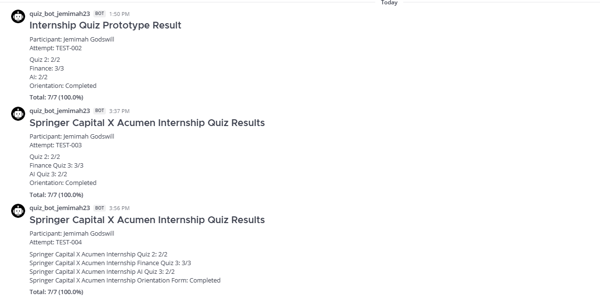

# Task #5247 — Intern Automation and Quiz Workflows

Mattermost automation for attendance, worklogs, reporting, and onboarding FAQs, extended with Baserow quiz grading and department-specific Quiz 3 submission workflows.

## Implementation

| Component | Purpose |
| --- | --- |
| FastAPI application | Attendance, worklog/digest, and FAQ modules, with PostgreSQL and Mattermost API integration targets |
| Native Mattermost form | Collect quiz details through `/quiz` and post entered scores through n8n |
| Baserow quiz grading | Validate submissions, calculate scores for selected questions, save results, and notify Mattermost |
| Quiz 3 replicas | Process AI, DevOps, and Backend submissions using the existing HR workflow as the reference |

The native Mattermost form records an entered score. The separate Baserow grading workflow calculates scores.

## Quiz Grading Results

Submissions are matched by **personal email and Attempt ID**, validated, and compared against the configured answer key.

| Assessment | Verified Result |
| --- | --- |
| Quiz 2 | 2/2 |
| Finance Quiz 3 | 3/3 |
| AI Quiz 3 | 2/2 |
| Orientation | Completed |
| **Total** | **7/7 — 100%** |

The total covers seven configured questions. Orientation completion is tracked separately.



## Quiz 3 Submission Replicas

Replicated the HR workflow for **AI, DevOps, and Backend**, adapting department-specific source tables and field mappings. The original HR workflow remains unchanged.

Each replica:

1. Retrieves unprocessed Quiz 3 submissions.
2. Finds the intern by email and updates or creates a completion tracking record.
3. Merges the branches and waits five seconds.
4. Sends a confirmation email through Outlook.
5. Creates a pre-onboarding record.
6. Marks the source submission as processed.

**Status:** All three workflows passed submission testing and are published. Review n8n’s execution history to verify subsequent scheduled runs.

### Review Links

- [Intern Quiz Completion Tracking (928)](https://baserow-intern.pmx.acumen-strategy.com/database/265/table/928/3799)
- [Intern Pre-Onboarding List (922)](https://baserow-intern.pmx.acumen-strategy.com/database/265/table/922/3788)

These shared Baserow result tables require appropriate access permissions.

## Validation and Evidence

- **Application:** 16 tests passed with **87.56% coverage**; API and container health checks passed.
- **CI:** GitHub Actions passed with SHA-pinned actions, Ruff, preflight, and dependency checks.
- **Mattermost:** Native form and bot delivery verified in the isolated test channel and Town Square.
- **Quiz 3:** Completion tracking, confirmation emails, pre-onboarding records, and source updates verified with test submissions.
- **Reusability:** Sanitized custom-form template imported successfully.

Supporting evidence: [Native form](docs/evidence/task5247-quiz-form.png) · [n8n execution](docs/evidence/task5247-n8n-success.png) · [Town Square delivery](docs/evidence/task5247-town-square-success.png) · [CI validation](docs/evidence/task-5247-phase-2-ci-validation-passed.png)

## Local Verification

```bash
python3 -m venv .venv
.venv/bin/python -m pip install -r requirements-dev.txt
.venv/bin/ruff check .
.venv/bin/python scripts/preflight.py
.venv/bin/pytest --cov=app --cov-report=term-missing
```

Recorded coverage applies to the Python application, not the n8n workflows.

## Scope and Security

Pre-onboarding record creation does not provision user accounts. Additional channel rollout and account provisioning remain outside the verified scope.

Store credentials in n8n’s credential store and sanitize workflow exports before committing.