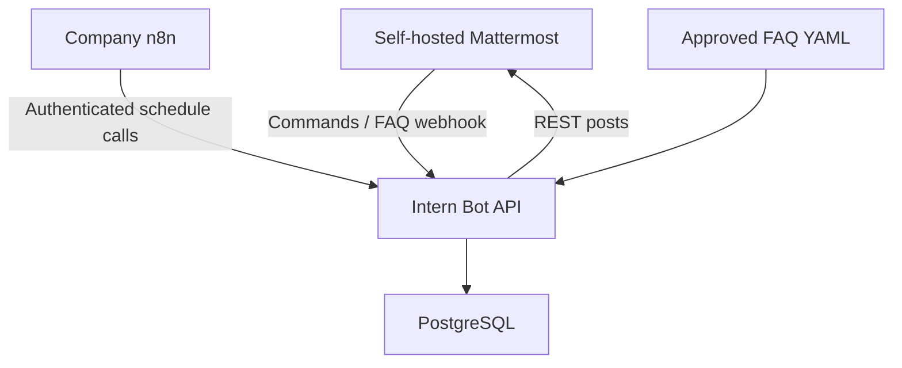
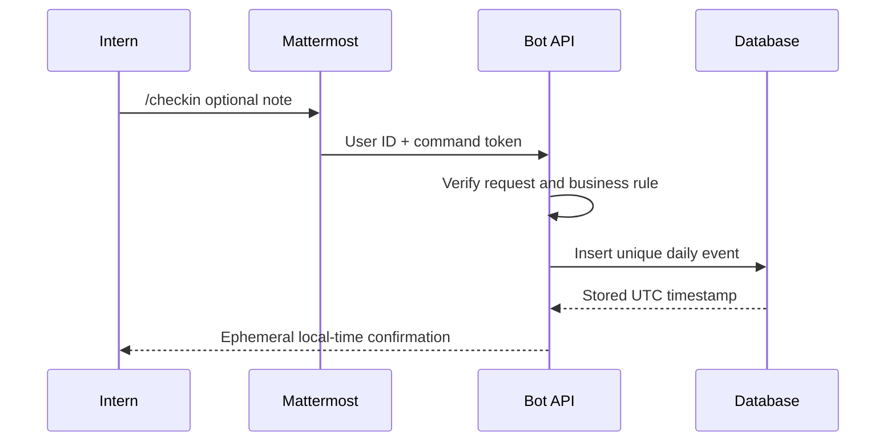
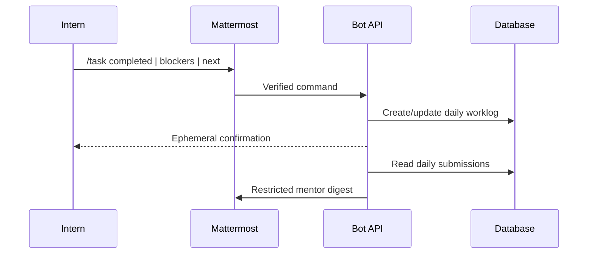
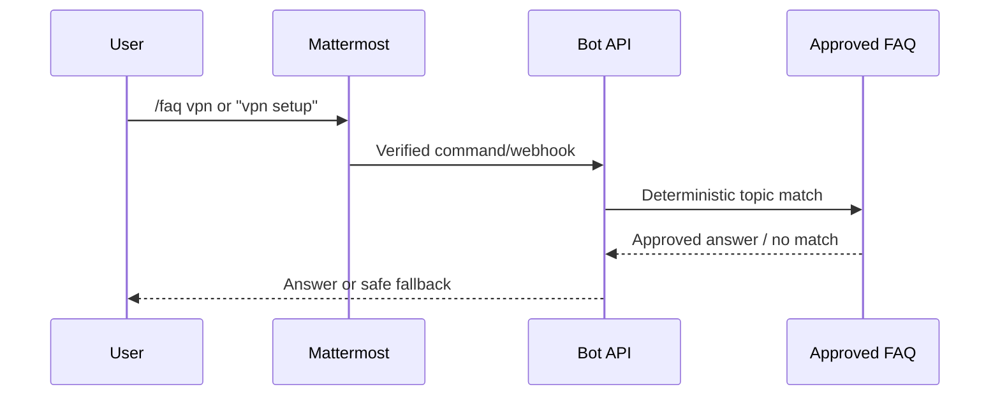
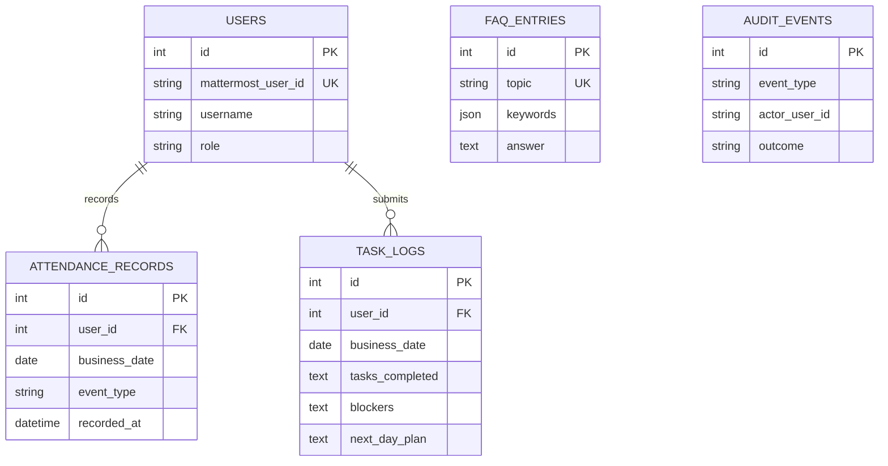

# Task #5247 — Technical Architecture

**Decision:** Hybrid workflow orchestration with an external bot service  
**PoC stack:** n8n, Python 3.12, FastAPI, PostgreSQL, Docker Compose  
**Compatibility target:** Company Mattermost v11.10.x; exact patch and edition remain deployment gates

## 1. Decision Record

| Pattern | Fit | Decision |
|---|---|---|
| Bot account + REST API + slash commands | Full workflow, isolated deployment, least privilege | **Selected** |
| n8n orchestration | Company-provided scheduler, visible executions, fast operational changes | **Selected for schedules** |
| Webhooks only | Simple, but insufficient for scheduled/API/admin workflows | Supporting only |
| Apps Framework | Official repository is deprecated and unmaintained | Rejected |
| Plugin SDK | Deep integration, but broad server access and Go/server coupling | Deferred |

PostgreSQL is the shared system of record because it provides transactions, uniqueness constraints, concurrency, backups, and reporting. SQLite is used only for isolated local tests. FAQ content remains human-editable YAML and is synchronized into the database.

## 2. System View

- Mattermost sends verified slash-command and keyword-webhook requests.
- The bot stores business records and responds ephemerally.
- n8n triggers weekday reminders and the mentor digest using a separate machine key.
- FastAPI keeps authorization, business rules, data access, auditing, and the bot token.
- PostgreSQL is private; only the API is exposed through approved HTTPS routing.

The live deployment sets `SCHEDULER_ENABLED=false`. APScheduler remains only as a
local fallback, preventing duplicate posts while keeping local testing independent.

## 3. Required Workflows

Attendance rules:

- Store UTC; derive the working date using the configured IANA timezone.
- Permit one check-in and one check-out per user/day.
- Reject check-out before check-in and duplicate events.
- Use immutable Mattermost user IDs for identity; username is display metadata.

The FAQ bot does not invent answers. Unknown questions return approved topic guidance.

## 4. Data Model

Database guarantees:

- unique Mattermost user ID;
- unique `(user, business_date, event_type)` attendance event;
- unique `(user, business_date)` worklog;
- unique FAQ topic;
- indexed date fields for digests and exports.

## 5. API and Permission Model

| Endpoint | Purpose | Access |
|---|---|---|
| `POST /mattermost/commands/checkin` | Record check-in | Command token |
| `POST /mattermost/commands/checkout` | Record check-out | Command token |
| `POST /mattermost/commands/task` | Submit/update worklog | Command token |
| `POST /mattermost/commands/faq` | Query/list FAQs | Command token |
| `POST /mattermost/webhooks/faq-keyword` | Match approved keyword | Webhook token |
| `GET /admin/exports/{type}` | Export date-scoped CSV | Admin key + mentor user ID |
| `POST /admin/faqs/reload` | Reload approved FAQ | Admin key + mentor user ID |
| `POST /admin/digests/{date}` | Publish digest | Admin key + mentor user ID |
| `GET /health/live` | Process health | Internal route |
| `GET /health/ready` | Database readiness | Internal route |
| `POST /automation/reminders/{type}` | n8n reminder trigger | Automation machine key |
| `POST /automation/digests/today` | n8n digest trigger | Automation machine key |

| Role | Allowed actions |
|---|---|
| Intern | Own attendance, worklog, approved FAQ |
| Mentor | Intern actions plus restricted digest and exports |
| Mattermost admin | Provision bot, commands, webhook, channels |
| Bot | Post only to configured channels; no system-admin role |
| n8n | Invoke only `/automation/*`; no database, export, or bot-token access |

## 6. Security and Operations

- Dedicated bot identity; never automate with a human/system-admin PAT.
- Runtime secret injection; `.env`, tokens, webhook URLs, and credentials are ignored by Git.
- Constant-time token comparison and server-side user-ID authorization.
- Separate n8n machine credential restricted to two automation routes.
- HTTPS with approved CA validation; no TLS bypass.
- Non-root, read-only container with dropped Linux capabilities.
- PostgreSQL has no public host port.
- Structured JSON logs, request IDs, health checks, and audit events.
- Worklog content and secrets are excluded from operational logs.
- n8n is the single live scheduler; the internal scheduler stays disabled.
- Production requires Alembic migrations, backup/restore proof, retention policy, image scanning, metrics, and alerts.

## 7. Deployment and Rollback

1. Confirm Mattermost 11.10 patch, edition, integration settings, timezone, and role source.
2. Create isolated test and mentor channels.
3. Deploy PostgreSQL and the bot behind validated HTTPS.
4. Provision the dedicated bot, four commands, and FAQ webhook.
5. Import the inactive n8n template, select the restricted header credential, and test each node manually.
6. Inject secrets; test health, identity, permissions, and all three modules.
7. Activate n8n only after confirming the bot's internal scheduler is disabled.
8. Demonstrate to stakeholders, then promote the same immutable image.

Rollback: deactivate the n8n workflow, disable the four commands/webhook, stop the
bot, and retain the database under the approved data policy. Mattermost itself is unchanged.

## 8. Compatibility Gate

The company environment is confirmed as Mattermost v11.10.x. The PoC uses documented
v11 bot accounts, REST API v4, slash commands, and outgoing webhooks. The exact patch
and edition must be captured in redacted live evidence; v11.10.1 or later in the 11.10
line is preferred because it includes security fixes released on 25 August 2026.

## Official References

- [Bot accounts](https://developers.mattermost.com/integrate/reference/bot-accounts/)
- [Custom slash commands](https://developers.mattermost.com/integrate/slash-commands/custom/)
- [Outgoing webhooks](https://developers.mattermost.com/integrate/webhooks/outgoing/)
- [REST API](https://developers.mattermost.com/integrate/reference/rest-api/)
- [Plugin security](https://developers.mattermost.com/integrate/plugins/using-and-managing-plugins/)
- [Deprecated Apps Framework](https://github.com/mattermost/mattermost-plugin-apps)
- [Server releases](https://docs.mattermost.com/product-overview/mattermost-server-releases.html)
- [n8n Schedule Trigger](https://docs.n8n.io/integrations/builtin/core-nodes/n8n-nodes-base.scheduletrigger/)
- [n8n HTTP Request credentials](https://docs.n8n.io/integrations/builtin/credentials/httprequest/)
